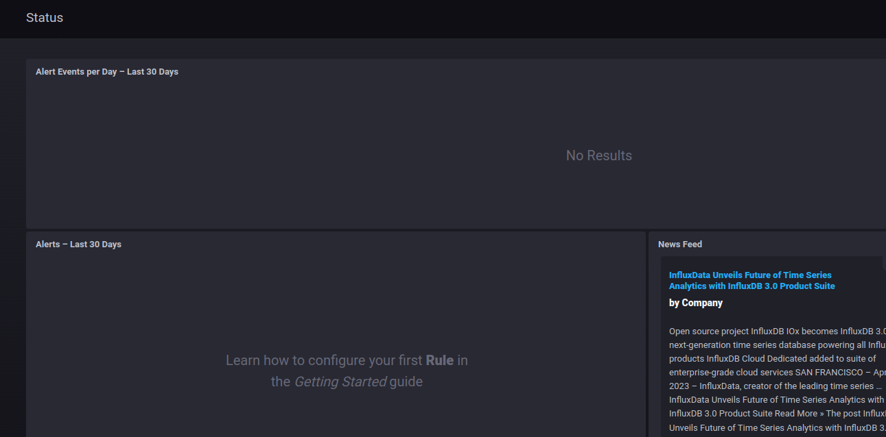
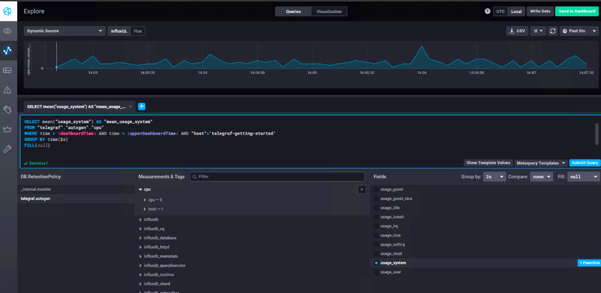
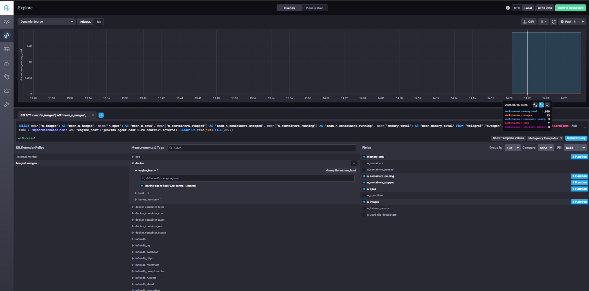

# Домашнее задание к занятию "`Домашнее задание к занятию «13.Системы мониторинга»`" - `Шатый Константин`

### Инструкция по выполнению домашнего задания

   1. Сделайте `fork` данного репозитория к себе в Github и переименуйте его по названию или номеру занятия, например, https://github.com/имя-вашего-репозитория/git-hw или  https://github.com/имя-вашего-репозитория/7-1-ansible-hw).
   2. Выполните клонирование данного репозитория к себе на ПК с помощью команды `git clone`.
   3. Выполните домашнее задание и заполните у себя локально этот файл README.md:
      - впишите вверху название занятия и вашу фамилию и имя
      - в каждом задании добавьте решение в требуемом виде (текст/код/скриншоты/ссылка)
      - для корректного добавления скриншотов воспользуйтесь [инструкцией "Как вставить скриншот в шаблон с решением](https://github.com/netology-code/sys-pattern-homework/blob/main/screen-instruction.md)
      - при оформлении используйте возможности языка разметки md (коротко об этом можно посмотреть в [инструкции  по MarkDown](https://github.com/netology-code/sys-pattern-homework/blob/main/md-instruction.md))
   4. После завершения работы над домашним заданием сделайте коммит (`git commit -m "comment"`) и отправьте его на Github (`git push origin`);
   5. Для проверки домашнего задания преподавателем в личном кабинете прикрепите и отправьте ссылку на решение в виде md-файла в вашем Github.
   6. Любые вопросы по выполнению заданий спрашивайте в чате учебной группы и/или в разделе “Вопросы по заданию” в личном кабинете.
   
Желаем успехов в выполнении домашнего задания!
   
### Дополнительные материалы, которые могут быть полезны для выполнения задания

Задание 1. 

Метрики использования ЦПУ:

1. Загрузка ЦПУ (CPU Usage): Основная метрика для понимания загрузки процессора. Важно отслеживать как общую загрузку, так и загрузку по каждому ядру, чтобы выявить возможные узкие места.
Средняя загрузка (Load Average): Показатель средней нагрузки на систему за последние 1, 5 и 15 минут. Позволяет понять тренды нагрузки и выявить моменты пикового использования.
Метрики памяти:

2. Использование оперативной памяти (Memory Usage): Показатель текущего использования оперативной памяти. Важно контролировать, чтобы система не исчерпала доступную память, что может привести к проблемам с производительностью.
Использование swap (Swap Usage): Указывает на использование файла подкачки. Частое использование swap может свидетельствовать о нехватке оперативной памяти и приводить к деградации производительности.
Метрики дисковой подсистемы:

3. Использование дискового пространства (Disk Space Usage): Важно отслеживать использование дискового пространства, особенно если текстовые отчеты занимают значительный объем.
Скорость чтения/записи (Disk I/O): Позволяет понять, насколько интенсивно используются дисковые ресурсы для чтения и записи данных.
Метрики сети:

4. Входящий/исходящий трафик (Network In/Out): Показатели сетевой активности, которые важны для понимания нагрузки на сеть и производительности HTTP-запросов.
Количество активных подключений (Active Connections): Помогает оценить текущую нагрузку на сервер.
Метрики HTTP-сервера:

5. Количество запросов в секунду (Requests per Second): Позволяет оценить текущую нагрузку на HTTP-сервер.
Время ответа (Response Time): Критически важно для оценки производительности платформы с точки зрения пользователя.
Коды ответов HTTP (HTTP Status Codes): Мониторинг кодов состояния (200, 404, 500 и т.д.) помогает выявить и диагностировать ошибки в работе сервера.
Системные метрики и логирование:

6. Логи ошибок (Error Logs): Сбор и анализ логов ошибок помогает быстро выявлять и устранять проблемы в работе приложения.
Логи приложений (Application Logs): Полезны для более глубокой диагностики и анализа поведения приложения.

Задание 2. 

1. Метрики SLA (Service Level Agreement):
Доступность сервиса (Uptime): Показывает процент времени, когда сервис был доступен пользователям. Обычно выражается в процентах (например, 99.9%).
Время отклика сервера (Server Response Time): Среднее время, необходимое для обработки HTTP-запросов. Помогает оценить, насколько быстро пользователи получают ответы от системы.

2. Метрики пользовательского опыта:
Время генерации отчетов (Report Generation Time): Среднее время, необходимое для генерации текстового отчета. Это ключевой показатель для оценки качества обслуживания, так как клиенты ждут получения своих отчетов.
Успешность запросов (Request Success Rate): Процент успешных запросов (с кодом 2xx) от общего числа запросов. Помогает понять, насколько стабильно работает сервис.
Количество ошибок (Error Rate): Процент ошибок (коды 4xx и 5xx) от общего числа запросов. Высокий процент ошибок указывает на проблемы с сервисом, что напрямую влияет на пользовательский опыт.

3. Клиентские метрики:
Коэффициент удержания клиентов (Customer Retention Rate): Процент клиентов, которые продолжают пользоваться услугами платформы в течение определенного периода.
Количество активных пользователей (Active Users): Количество пользователей, активно использующих платформу в течение определенного времени (день, неделя, месяц).
NPS (Net Promoter Score): Индекс удовлетворенности клиентов, который измеряет, насколько пользователи готовы рекомендовать платформу другим.

4. Метрики производительности:
Средняя нагрузка на процессор (CPU Load Average): Средняя нагрузка на процессор за последние 1, 5 и 15 минут. Важно объяснить, что это показатель общей занятости процессора, который влияет на способность сервера обрабатывать запросы.
Использование оперативной памяти (RAM Usage): Количество используемой оперативной памяти. Важно объяснить, что это показатель того, сколько ресурсов используется для выполнения задач, и что недостаток памяти может замедлить работу системы.

5. Метрики файловой системы:
Использование inode (Inode Usage): Количество используемых индексов файловой системы. Объяснить, что это важно для понимания того, сколько файлов может быть создано на диске, и что недостаток inode может привести к невозможности создания новых файлов.

Задание 3. 

1. Использование встроенных возможностей платформы:
Ротация и архивирование логов: Настройка ротации и архивирования логов с использованием встроенных инструментов (например, logrotate в Linux). Это позволит хранить логи на сервере в структурированном виде.
Простой HTTP-эндпоинт для логов: Создание простого HTTP-эндпоинта, который будет собирать и предоставлять доступ к логам ошибок. Разработчики смогут отправлять POST-запросы с логами ошибок на этот эндпоинт, а затем просматривать их через веб-интерфейс или API.

2. Использование системных инструментов:
Syslog: Настройка отправки логов в системный журнал (syslog). Это позволит централизованно собирать и управлять логами на уровне операционной системы. Логи можно фильтровать и просматривать с использованием утилит типа journalctl.
E-mail уведомления: Настройка системы отправки email-уведомлений при возникновении критических ошибок. Например, использовать mailx или sendmail для отправки логов ошибок на заранее определенный адрес электронной почты.

3. Интеграция с сервисами и инструментами:
Чат-оповещения: Использование интеграции с корпоративными чатами (Slack, Microsoft Teams) для отправки уведомлений об ошибках. Для этого можно использовать webhooks или API данных платформ, чтобы при возникновении ошибок отправлять сообщения в соответствующие каналы.
Сторонние бесплатные или недорогие сервисы: Использование бесплатных или недорогих сервисов для сбора логов, таких как Loggly (ограниченный бесплатный тариф) или другие аналогичные сервисы, которые предлагают базовые функции бесплатно или по низкой цене.

4. Локальные решения и скрипты:
Скрипты для агрегации логов: Написание простых скриптов на Bash, Python или другом языке для агрегации логов и их периодической отправки разработчикам (например, ежедневные отчеты на email).
Файловая система общего доступа: Использование сетевых хранилищ (NFS, SMB) для создания общего доступа к логам. Разработчики смогут просматривать логи, размещенные на общих дисках.

5. Локальные интерфейсы и дашборды:
Локальные веб-интерфейсы: Разработка простого веб-интерфейса для просмотра логов. Это может быть легковесное приложение, работающее на сервере и предоставляющее доступ к логам через веб-браузер.

Задание 4. 

Информационные ответы (100 – 199)
Успешные ответы (200 – 299)
Сообщения о перенаправлении (300 – 399)
Ошибки клиента (400 – 499)
Ошибки сервера (500 – 599)

Можно поменять формулу добавить summ_successful_requests вместо summ_2xx_requests где будут учитываться коды 3хх
summ_successful_requests - общее количество успешных запросов, включая коды ответов 2xx и 3xx.

Пример расчета на Python:

# Примерные данные
summ_2xx_requests = 700
summ_3xx_requests = 300
summ_4xx_requests = 0
summ_5xx_requests = 0

# Обновленный расчет успешных запросов
summ_successful_requests = summ_2xx_requests + summ_3xx_requests
summ_all_requests = summ_2xx_requests + summ_3xx_requests + summ_4xx_requests + summ_5xx_requests

# Обновленный расчет SLA
sla = summ_successful_requests / summ_all_requests * 100

print(f"SLA: {sla:.2f}%")  # Это даст нам точный показатель SLA

Задание 5. 

Pull-системы мониторинга
В pull-системах мониторинга центральный сервер или агрегатор данных запрашивает метрики от агентов, установленных на каждом мониторимом узле или сервисе.

Плюсы:

Централизованный контроль: Централизованный сервер контролирует, какие данные запрашиваются и когда. Это позволяет легко управлять частотой опроса и настройками метрик.
Безопасность: Узлы не нуждаются в знании об адресах централизованного сервера, что снижает вероятность злоупотреблений.
Упрощенная конфигурация узлов: Узлы не требуют сложной настройки для отправки данных, достаточно настроить единый центральный сервер.
Легкость управления: Добавление или удаление узлов из системы мониторинга выполняется на центральном сервере, без необходимости изменений на самих узлах.

Минусы:

Масштабируемость: Централизованный сервер может стать узким местом при увеличении количества мониторимых узлов, так как он должен опрашивать большое количество агентов.
Сложность в сетях с ограниченным доступом: Если узлы находятся за NAT или в сетях с ограниченным доступом, централизованный сервер может иметь трудности с доступом к ним.
Задержка данных: Периодическое опрашивание может приводить к задержке в получении данных, что может быть критично для высокочастотных метрик.
Push-системы мониторинга
В push-системах мониторинга агенты на узлах сами отправляют метрики на централизованный сервер или агрегатор данных.

Плюсы:

Масштабируемость: Система легче масштабируется, так как нагрузка распределяется по узлам, которые сами отправляют данные.
Реальное время: Метрики могут отправляться в реальном времени, что снижает задержку в получении данных.
Гибкость: Узлы могут отправлять данные в несколько серверов мониторинга или других систем одновременно.
Сложные сети: Узлы за NAT или в ограниченных сетях могут легко отправлять данные на сервер, так как инициируют соединение сами.

Минусы:

Безопасность: Узлы должны знать адрес централизованного сервера, что может создавать потенциальные риски для безопасности.
Управление конфигурацией: Изменение конфигурации требует обновления настроек на всех узлах, что может быть сложным в больших масштабах.
Потеря данных: В случае временной недоступности сервера могут возникнуть потери данных, если агенты не настроены на повторную отправку данных.
Нагрузочное тестирование: Узлы могут создавать нагрузку на сеть и серверы при отправке данных с высокой частотой, что может потребовать дополнительных ресурсов и оптимизаций.

Задание 6. 

Prometheus
Модель: Pull
Описание: Prometheus использует модель pull, при которой он периодически опрашивает экспортёры (экспортеры) метрик, установленные на узлах. Хотя есть возможность использовать pushgateway для сценариев push, основная модель Prometheus — это pull.

TICK (Telegraf, InfluxDB, Chronograf, Kapacitor)
Модель: Push
Описание: TICK стек, особенно с использованием Telegraf, работает в модели push. Telegraf собирает метрики с различных источников и отправляет их в InfluxDB. В то же время, Telegraf может быть настроен для получения данных через pull-модель, что делает TICK стек гибридным.

Zabbix
Модель: Гибридная (Push и Pull)
Описание: Zabbix поддерживает оба подхода. Он может активно опрашивать агенты (pull), а также принимать данные, отправленные агентами (push). Эта гибкость позволяет адаптировать Zabbix под различные сценарии использования.

VictoriaMetrics
Модель: Гибридная (Push и Pull)
Описание: VictoriaMetrics поддерживает оба подхода. Она может принимать данные от Prometheus в режиме pull и от различных агентов и систем в режиме push, что делает её гибридной системой.

Nagios
Модель: Pull
Описание: Nagios преимущественно использует pull-модель, при которой он опрашивает мониторируемые сервисы и узлы. Однако, с помощью дополнительных модулей и плагинов можно настроить Nagios для приёма push-уведомлений, что в некоторой степени делает его гибридным.

Задание 7. 

Задание 8.

Задание 9. 

